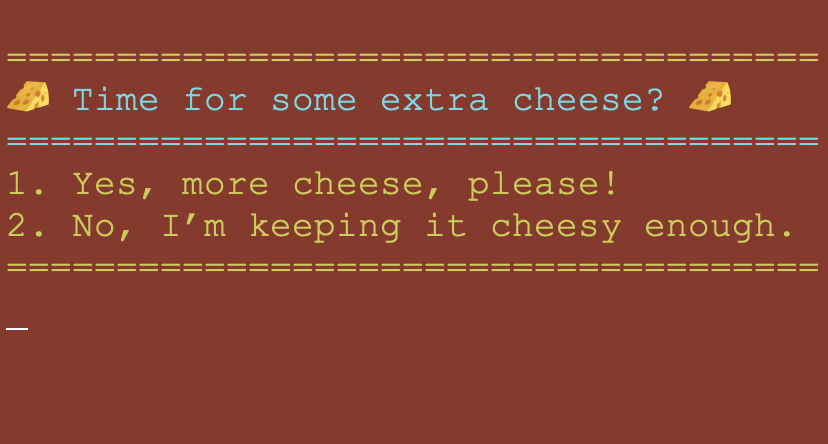

# Welcome to Deli-cious!

Deli-cious is a command-line interface (CLI) application designed for a custom sandwich shop. It allows customers to place an order for sandwiches, drinks, and chips, offering full customization options for each item. Customers can select sandwich sizes, bread types, toppings, and extras like extra meat and cheese. The app also allows the selection of drink flavors and chip types, making each order truly personalized.

## Home Screen and Order Screen

The home screen welcomes users to Deli-cious, offering the option to place an order or exit the application. Once the user selects “Place an order,” the order screen, the program prompts the user to select wether they would like to add a sandwich,drink, or bag of chips to their order.

## User options for sandwich customization

The sandwich customization options allow users to choose the size, bread type, and whether they want the sandwich toasted. Additionally, users can select from a variety of toppings, including meats, cheeses, veggies, and sauces, with options for adding extra meat or cheese to personalize their sandwich further.
## Drink options

The drink customization allows users to choose from three sizes small, medium, or large and select their preferred flavor from a list of available options. Users can easily add drinks to their order based on size and flavor preferences, continuing their meal customization.
## Chip options

The chips customization lets users select from a variety of chip types, such as BBQ, Jalapeno, and Lays, and choose how many bags they would like to add to their order. This simple option enhances the meal, offering a crunchy side to complement the sandwiches and drinks.
## Order output and receipt

The order output provides a detailed summary of the customer’s selections, including sandwiches, drinks, and chips, along with the total price. After confirming the order, the receipt option generates a formatted receipt with the order details, including the customer’s name, items, and the final total, which is saved to a file for easy reference.
## Interesting piece of code I developed for this project

In this piece of code, I used a stack of HashMaps to store the prices of different premium toppings for sandwiches based on their size. The outer HashMap has the topping name (like “Steak”, “Ham”, etc.) as the key, and each key maps to another HashMap that associates each Sandwich.Size (Small, Medium, Large) with its respective price. This structure makes it easy to manage the prices of each topping for various sandwich sizes, and allows for dynamic price retrieval based on both the topping and the sandwich size chosen by the customer.
## Diagrams used to develop the project

I initially started the project without a Receipt class and without PremiumTopping and RegularTopping subclasses. However, as the project progressed, I found these additions were necessary. I added the Receipt class to handle generating and saving order receipts, which was crucial for structuring and outputting the order details. Additionally, I introduced the PremiumTopping and RegularTopping subclasses to manage the different types of toppings (meats, cheeses, veggies, sauces) and their specific pricing. These updates helped organize the code more efficiently and ensured accurate pricing and order management. These diagrams were essential to my understanding and completion of the program.